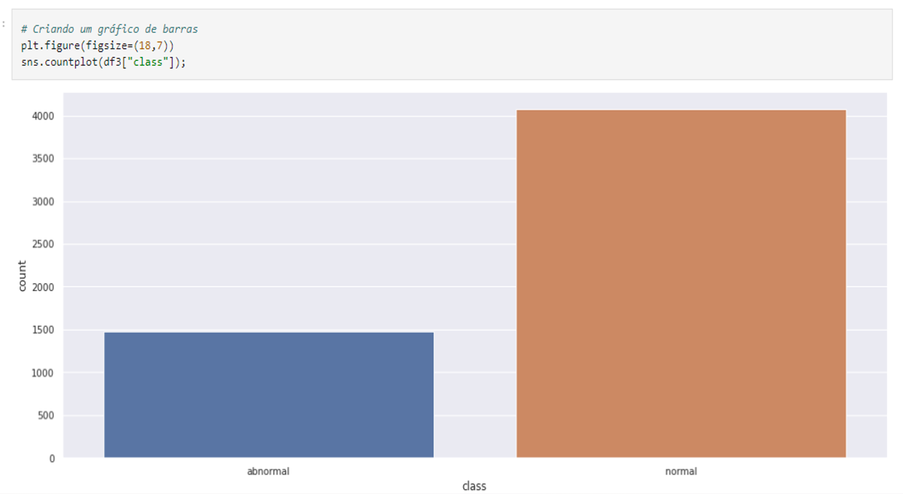
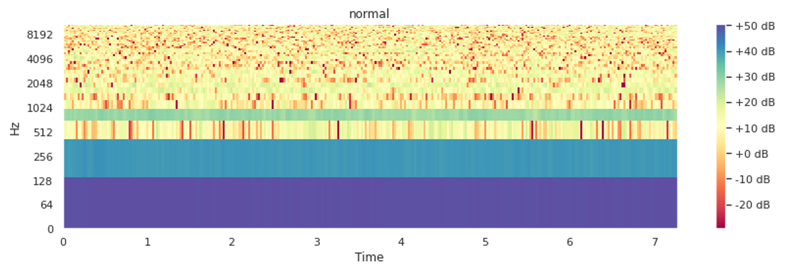

<h1 align="center">Detector de Anomalias por Classificação de Áudio
</h1>

 

## Demonstração da Ferramenta

## Links

- Streamlit - [Streamlit Folder](https://github.com/lizmarques/Audio_Anomaly_Detection_Project/tree/master/DeteccaodeAnomaliasporAudio)
- Google Colab Notebook - [Detecção de Anomalias por Classificação de Áudio.ipynb]([GOOGLE_COLAB]_Detecção_de_Anomalias_por_Classificação_de_Áudio.ipynb)

## Objetivo

Inserida no contexto de Smart Factories*, a ferramenta de Detecção de Anomalias por Classificação de Áudio tem como principais objetivos:
- Reduzir os custos com manutenção
- Otimizar a produção
- Diminuir interrupções não planejadas
- Aumentar a produtividade do maquinário no setor industrial

O modelo atual foi desenvolvido com foco em identificar anomalias de ventiladores industriais. No entanto, é possível aplicá-lo em diferentes tipos de maquinários como: bombas, válvulas ou até mesmo trilhos deslizantes. Para isso, basta ter os dados correspondentes.

*Smart Factories são indústrias com um alto nível de digitalização que facilitam a coleta de dados e informações por meio dos dispositivos tecnológicos

## Fonte dos dados: MIMII Dataset

O MIMII (Malfunctioning Industrial Machine Investigation and Inspection) dataset é um conjunto de dados de áudio para investigação e inspeção de máquinas industriais com defeito. Ele contém sons gerados por quatro tipos de máquinas industriais:
- Válvulas Solenóide (solenoid valves)
- Bombas de Água (water pumps)
- Ventiladores Industriais (industrial fans)
- Trilhos Deslizantes (slide rails)

O dataset possui um total de 32.157 sons (100.2 GB) no formato wave, sendo:
- 26.092 sons normais
- 6.065 sons anômalos

Para o atual projeto, optei pelos Ventiladores Industriais, pois, dentre os 4 tipos de máquina, ele possuia o dataset menos desbalanceado. A seguir algumas informações básicas:
- Total: 9819 sons
- 7230 sons normais
- 2589 sons anômalos (correspondem a 26.37% do dataset)

E, dentro do grupo dos Ventiladores Industriais, escolhi o Grupo 0_dB_fan:
- Total: 5550 sons
- 4075 sons normais
- 1475 sons anômalos

Cada tipo de máquina inclui vários modelos de produtos individuais e os dados de cada modelo contêm sons normais e anômalos. Para se assemelhar a um cenário da vida real, vários sons anômalos foram gravados. Além disso, o ruído de fundo gravado em várias fábricas reais foi misturado com os sons da máquina.

Os sons anômalos contidos no dataset podem ser de diferentes naturezas como:
- Contaminação
- Vazamento
- Desbalanceamento rotativo
- Danos no trilho

No caso dos Ventiladores Industriais, os sons anômalos se caracterizam por desbalanceamento, mudança de tensão e entupimento.

Todos os arquivos de áudio utilizados podem ser encontrados no site: https://zenodo.org/record/3384388#.Y3vbs3bMLrd

O artigo referente ao dataset pode ser encontrado no site: https://arxiv.org/abs/1909.09347

## Visualizando a distribuição

Ao observar a quantidade de arquivos para cada classe fica evidente que temos um dataset bem desbalanceado.

 
 
## Espectrogramas de MFCC (Coeficientes Cepstral de Frequência Mel)
  
Os espectrogramas são parte fundamental da nossa aplicação, pois, através deles, podemos observar o áudio em três domímios: 
- Tempo
- Frequência
- Amplitude
  

 
 O espectrograma nada mais é do que um conjunto de características extraídas do áudio e, por meio dessas características, podemos visualizar o gráfico acima.

Quando pensamos em aplicações de Machine Learning voltadas para áudio, a escala mel é muito relevante, já que ela imita as características únicas perceptíveis pelo ouvido humano. Ex: é muito mais fácil nós identificarmos a diferença de 100Hz-200Hz do que 10.100Hz-10.200Hz.

Um vez que os espectrogramas nada mais são do que imagens, podemos treinar uma rede neural convolucional para que ela aprenda a classificar os diferentes tipos de som baseada nas diferenças dos espectrogramas mfcc.
 
