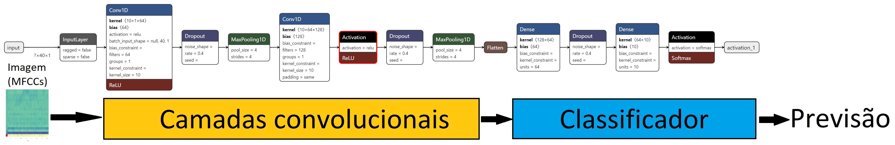
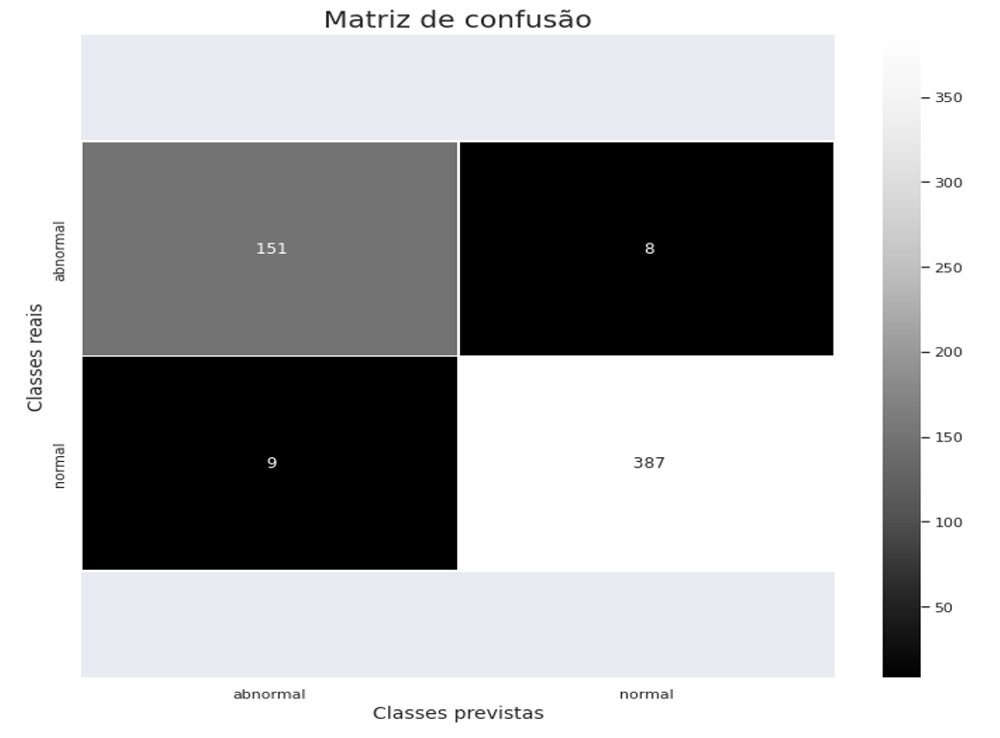
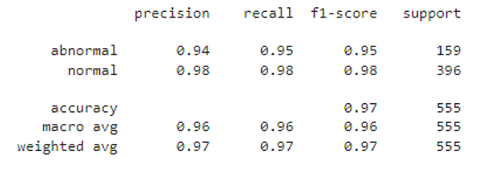

<h1 align="center">Anomaly Detector by Audio Classification</h1>

 

## Tool Demonstration

## Links

- Streamlit - [Streamlit Folder](https://github.com/lizmarques/Audio_Anomaly_Detection_Project/tree/master/DeteccaodeAnomaliasporAudio)
- Google Colab Notebook - [Detecção de Anomalias por Classificação de Áudio.ipynb]([GOOGLE_COLAB]_Detecção_de_Anomalias_por_Classificação_de_Áudio.ipynb)

## Objective

Inserted in the context of Smart Factories*, the Anomaly Detection tool through Audio Classification has the following main objectives:
- Reduce maintenance costs
- Optimize production
- Minimize unplanned interruptions
- Increase machinery productivity in the industrial sector
- The current model was developed with a focus on identifying anomalies in industrial fans. However, it can be applied to different types of machinery such as pumps, valves, or even sliding rails. To do so, you just need the corresponding data.

*Smart Factories are highly digitized industries that facilitate data and information collection through technological devices.

## Data Source: MIMII Dataset

The MIMII (Malfunctioning Industrial Machine Investigation and Inspection) dataset is an audio dataset for investigating and inspecting defective industrial machines. It contains sounds generated by four types of industrial machines:
- Solenoid Valves
- Water Pumps
- Industrial Fans
- Slide Rails

The dataset has a total of 32,157 sounds (100.2 GB) in wave format, with:
- 26,092 normal sounds
- 6,065 anomalous sounds

For the current project, Industrial Fans were chosen because, among the four types of machines, it had the least imbalanced dataset. Here are some basic statistics:
- Total: 9819 sounds
- 7230 normal sounds
- 2589 anomalous sounds (26.37% of the dataset)

Within the Industrial Fans group, the 0_dB_fan subgroup was selected: 
- Total: 5550 sounds
- 4075 normal sounds
- 1475 anomalous sounds

Each type of machine includes various individual product models, and the data for each model contains both normal and anomalous sounds. To simulate a real-life scenario, various anomalous sounds were recorded. Additionally, background noise recorded in various real factories was mixed with machine sounds.

The anomalous sounds in the dataset can have different natures such as:
- Contamination
- Leakage
- Rotational imbalance
- Rail damage

For Industrial Fans, anomalous sounds are characterized by imbalance, voltage changes, and blockage.

All audio files used can be found on the website: https://zenodo.org/record/3384388#.Y3vbs3bMLrd

The article related to the dataset can be found on the website: https://arxiv.org/abs/1909.09347

## Visualizing the Distribution

Observing the number of files for each class makes it clear that we have a highly imbalanced dataset.

 
 
## MFCC (Mel-Frequency Cepstral Coefficients) Spectrograms
  
Spectrograms are a fundamental part of our application as they allow us to observe audio in three domains:

- Time
- Frequency
- Amplitude
  

 
 
 The spectrogram is a set of features extracted from the audio, and through these features, we can visualize the graph above.

When thinking about Machine Learning applications for audio, the mel scale is very relevant as it mimics the unique characteristics perceptible to the human ear. For example, it is much easier for us to identify the difference between 100Hz-200Hz than 10,100Hz-10,200Hz.

Now that we understand what a spectrogram is and what the mel scale does, we can conclude that spectrograms are essentially images. Therefore, we can train a convolutional neural network to learn to classify different types of sounds based on the differences in MFCC spectrograms.
 
 ## Model: Convolutional Neural Network (CNN)
 
 The architecture of the neural network used in this project is simple, consisting of only 2 convolutional blocks. Below, there is an image depicting the architecture, followed by an explanation of the parameters.
 
 
 
  
  Parameters:
  * `Sequential`,  the class to create the neural network, as a neural network is a sequence of layers (input layer, hidden layers, output layer);
  * `kernel_size`, the size of the convolutional kernel (matrix);
  * `activation`, activation function;
  * `input_shape`,  in the first layer, this is the size of the input data;
  * `MaxPooling1D` Layer, extracts the main features;
  * `Conv1d` layer, a convolutional neural network that performs convolution along only one dimension;
  * `Flatten` layer,  transforms from matrix to vector;
  * `Dense` layer, when a neuron in one layer is connected to all other neurons in other layers;
  * `Dropout`, regularization technique to reduce overfitting: https://jmlr.org/papers/volume15/srivastava14a/srivastava14a.pdf
  * `padding='same'`, indicates that we add a new column composed of only 0s (zeros) and use the entire image: https://www.pico.net/kb/what-is-the-difference-between-same-and-valid-padding-in-tf-nn-max-pool-of-tensorflow/
 
 ## Confusion Matrix
 
 
 
  
Observing the confusion matrix, we can reach the following conclusions:
- 151 sounds were correctly classified as anomalous
- 387 sounds were correctly classified as normal
- 8 sounds that should have been classified as anomalous were classified as normal
- 9 sounds that should have been classified as normal were classified as anomalous
  
 ## Classification Report
  
 We can see that, although the dataset was highly imbalanced, the model performed well, achieving an accuracy of 97%. 
  
 
 
 
Examining the accuracy rate for each class, we find that:
- A recall of 98% for the normal class indicates that the model can correctly classify 98% of normal sound cases, and when this happens, it has 98% precision.
- A recall of 95% for the abnormal class indicates that the model can correctly classify 95% of anomalous sound cases, and when this occurs, it has 94% precision.
  
 ## Next Steps
- Train, test, and evaluate the model with other types of machines
- Adapt the project for real-time detection using hardware like Arduino, for example
